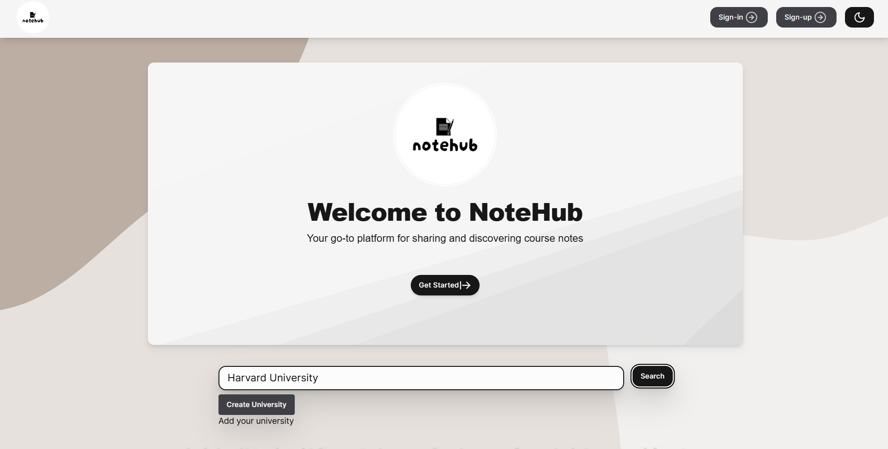

# NoteHub

**NoteHub** is a scalable note-sharing web application designed to enable university students to find classes and securely share notes. The application uses a robust technology stack to ensure performance, security, and a seamless user experience.

### Key Features

- **Scalable Architecture**: Built with TypeScript and React for the frontend, and Node.js with Azure Functions and Azure DynamoDB for the backend.
- **Secure Authentication**: Implements JWT-based authentication and session management with cookies, ensuring secure and persistent login states.
- **Optimized Performance**: Leverages Azure's serverless architecture for high availability, performance, and cost-effectiveness.
- **User-Friendly Interface**: Intuitive and responsive design that facilitates easy access to notes and collaboration among students.

---

## Technology Stack

- **Frontend**: TypeScript, React  
- **Backend**: Node.js, Azure Functions  
- **Database**: Azure DynamoDB  
- **Authentication**: JWT, Cookies  
- **Deployment**: Azure (Serverless Architecture)  

---

## Authentication & Features

- **Authentication:** Users must sign up or log in with their university email. JWT tokens are stored in secure, HTTP-only cookies.  
- **Note Sharing:** Students can search for classes, upload notes, and share them securely.  
- **Data Storage:** Notes are stored in Azure DynamoDB and are accessible only to authorized users.  

---

## Backend Status

Due to depleted Azure credits, the backend is currently inactive and unavailable.
